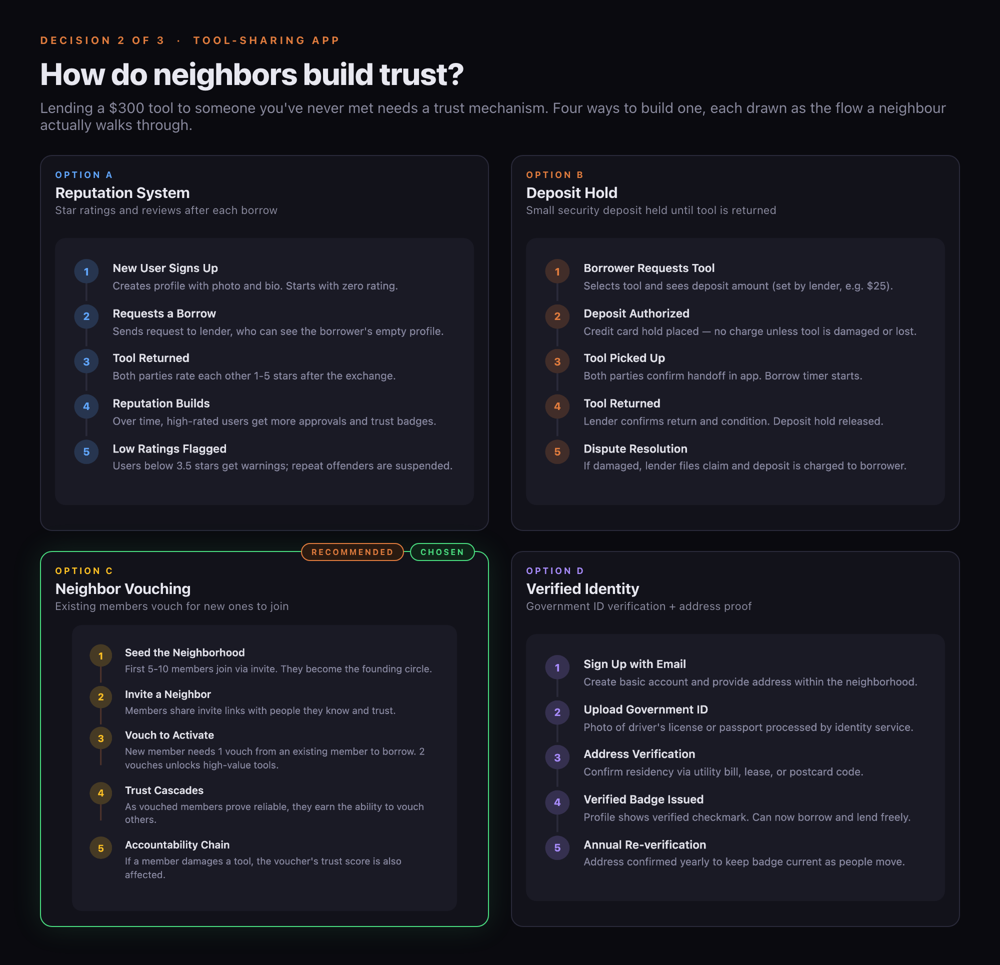
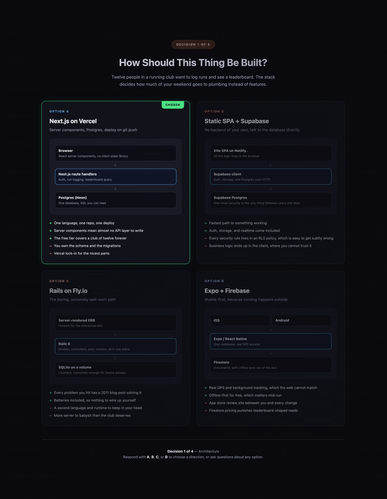
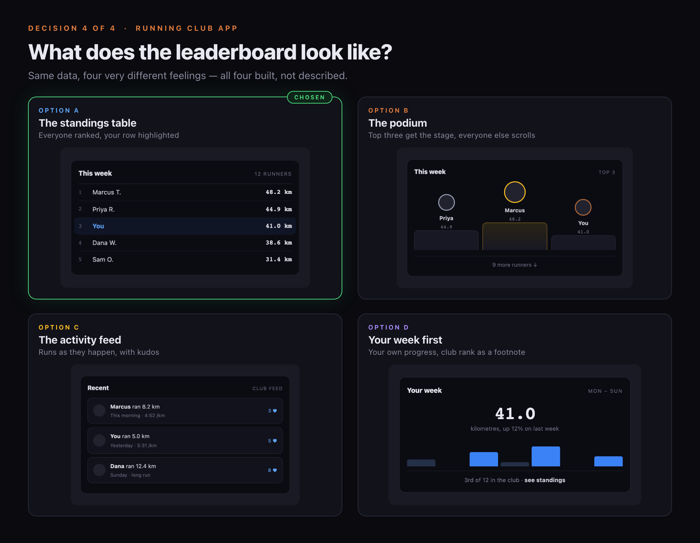
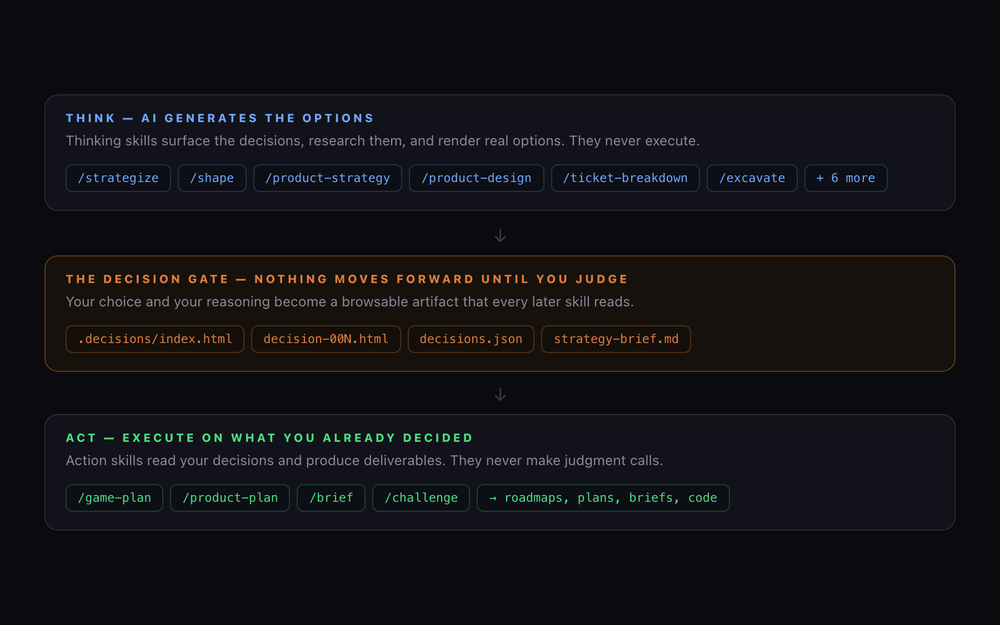
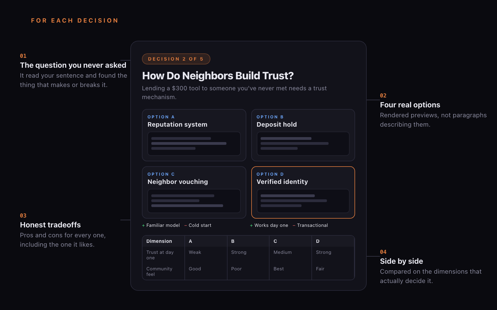
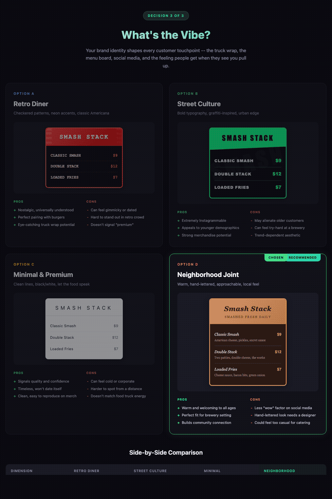
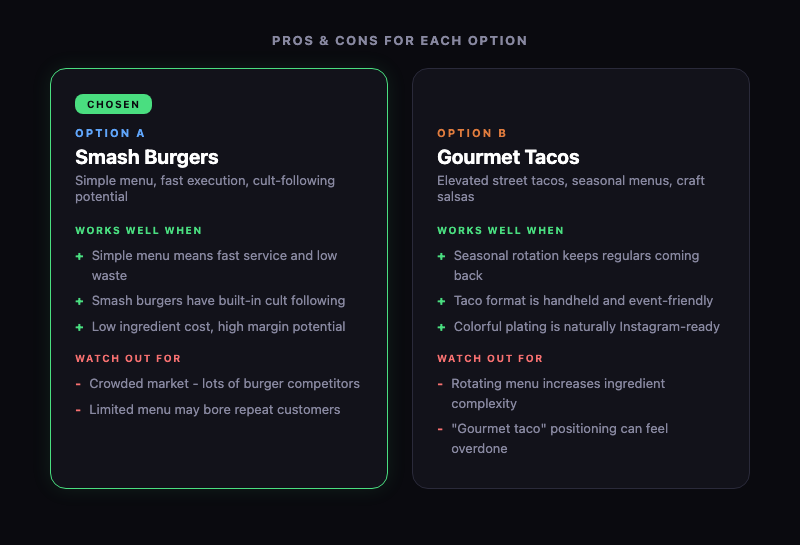
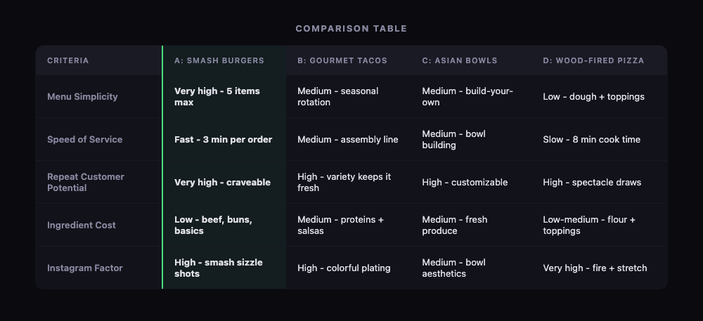
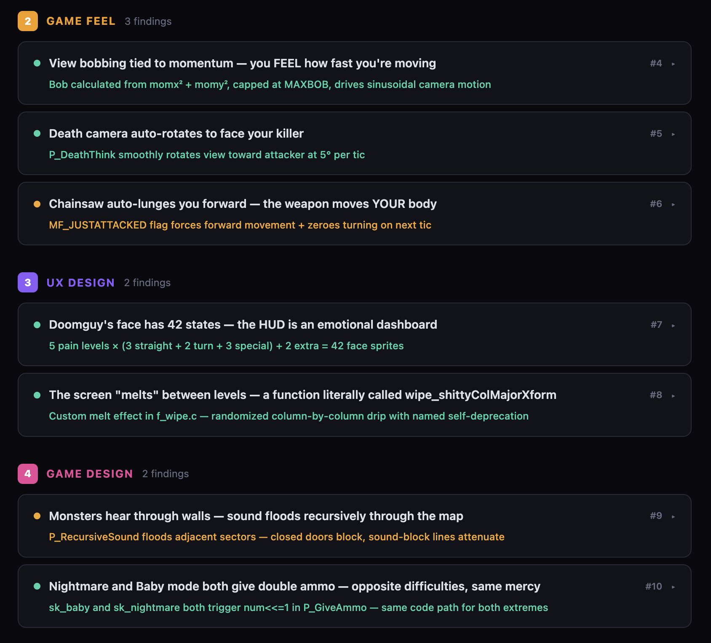
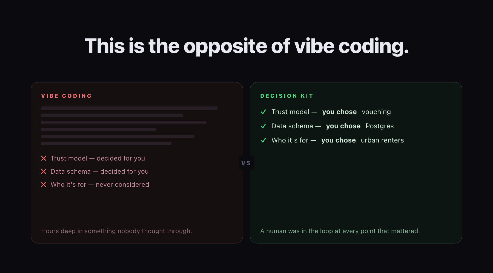

# Decision Kit

**AI does the busywork around your decisions. You make the calls.**

<p align="center">
<a href="#start-here-in-2-minutes"><strong>Install in 2 minutes</strong></a> &nbsp;·&nbsp;
<a href="#how-it-works">How it works</a> &nbsp;·&nbsp;
<a href="#the-decision-artifact">The decision artifact</a> &nbsp;·&nbsp;
<a href="#decisions-compound">Decisions compound</a> &nbsp;·&nbsp;
<a href="#already-have-code">Already have code?</a><br>
<a href="#how-this-compares">How this compares</a> &nbsp;·&nbsp;
<a href="examples/">Browse real runs</a> &nbsp;·&nbsp;
<a href="docs/skills.md">All 34 skills</a>
</p>

<p align="center"></p>

Decision Kit is the planning layer that runs before the building starts. It does not write
your app. It is the part that comes first, where somebody works out what is being built and
why — and that somebody is you.

**AI explores. You judge. Things get built.** That separation is the whole idea, and it has a
name: Decision Driven Development. Make the decisions structured, visual, and fast, and the
building gets better, because a human was in the loop at every point that mattered.

Every skill is a folder of plain markdown, so this runs on whatever agentic coding tool you
already use: Claude Code, Cursor, Codex, Copilot, Gemini CLI, your own. Nothing to install,
no API key, no account.

Here is what it looks like in practice. You type this:

```
/decide I wanna make a tool-sharing app for my neighborhood
```

And this comes back:

<p align="center"></p>

You didn't ask for this. You didn't design it. You didn't even know this was a decision you needed to make. The AI built this whole page out of nothing: the question, the four options, the visual previews, the tradeoffs, the comparison table, the recommendation. It read your one sentence, understood what you were actually trying to do, and surfaced the decision that makes or breaks the entire thing. "How do neighbors build trust?" Yeah. Obviously. How did you not think of that?

That keeps happening. Decision after decision, each one building on what you chose before. You came in with an idea and Decision Kit pulled out every decision hiding inside it, ordered them by what matters most, and walked you through each one with options you can actually see and compare. Not too many that you get decision fatigue, not too few that you're left wondering "wait, what are we actually building?"

You pick. It remembers. On to the next one. Go ahead, argue with the AI's recommendation. It's more fun that way.

---

## So what is it doing?

It reads your situation and finds the 5 to 7 decisions hiding inside it, ranked from most critical to least. For each one it does the work *around* the decision and then gets out of the way: gathers the research, builds four real options, renders visual previews, and lays the tradeoffs out side by side. Then it stops and waits for you. Every decision becomes an artifact you can open in a browser, compare, and still understand six months from now.

<p align="center"></p>

**This is the opposite of vibe coding.** Vibe coding is a blast: describe a thing, watch it get built, keep going. It works right up until you're hours deep in something nobody actually thought through, full of decisions that got made for you while you weren't looking. Decision Kit slows you down at the handful of moments where slow is worth it, then hands the build a real spec instead of a vibe.

When you're done, the decisions become the spec: hand them to an AI coding tool and it starts from a decision record instead of a blank prompt. Or don't. Decision Kit is happy being only a thinking tool.

Sibling project: [be-smarter](https://github.com/jnemargut/be-smarter). Decision Kit puts you in the loop. Be-smarter thinks that way even when you're not.

---

## The same thing, for code

The example above is a product question. Here is the same thing when what you are
building is software, and the options are technical.

<p align="center"></p>

One sentence in (*"an app where my running club can log runs and see a leaderboard"*),
four decisions out. Architecture drawn as a stack diagram per option. The data model as
the actual tables, with real column names. Auth as the code each choice makes you write.

And then the part people do not expect:

<p align="center"></p>

You are not reading a description of four layouts. You are looking at four layouts, built
from the same data, and the differences are the entire argument. The podium celebrates three
people and buries nine. The activity feed is the liveliest of them and also quietly hides
the ranking that was the actual request. The page spells out every one of those tradeoffs
(*"nine of twelve people are literally below the fold"*), and you pick before anyone writes
the component.

Four decisions later the folder is a spec. Hand it to Claude Code, Cursor, Codex, or
whatever you use, and the stack, the schema, the auth model, and the shape of the main
screen are already settled. The whole run is in
[examples/running-club-app](examples/running-club-app/).

---

## Start here in 2 minutes

**1. Clone:**
```bash
git clone https://github.com/jnemargut/decision-kit.git
```

**2. Install the skills where your agent looks for them.**

Every skill is a folder with a `SKILL.md` inside, so this works with any agentic
coding tool that can load custom skills or commands.

<details open>
<summary><strong>Claude Code</strong></summary>

```bash
mkdir -p ~/.claude/skills
cp -r decision-kit/{thinking,action,configuration,orchestrator}/* ~/.claude/skills/
```
Use `.claude/skills/` inside a project instead if you only want them there.
</details>

<details>
<summary><strong>Any other agent (Cursor, Codex, Copilot, Gemini CLI, Aider, your own)</strong></summary>

Copy those same four folders into whatever directory your tool reads custom
skills, commands, or rules from:

```bash
cp -r decision-kit/{thinking,action,configuration,orchestrator}/* <your-tool's-skills-dir>/
```

No skills directory? Nothing is stopping you. Keep the repo somewhere handy and
point the agent at a skill directly:

```
Read decision-kit/orchestrator/decide/SKILL.md and follow it.
I want to make a tool-sharing app for my neighborhood.
```

The skills are plain markdown instructions. Anything that can read a file can run them.
</details>

**3. Run:**
```
/decide my friend and I are thinking about launching a food truck
```

Don't know which skill to use? That's the whole point of `/decide`. Say what's on your mind and it figures out the rest.

Or go direct if you already know what you need:
```
/strategize thinking about opening a coffee shop downtown
```

That also installs the **X tier**: `x-` prefixed versions of the core skills that think harder and use more of your usage budget. See the [skills reference](docs/skills.md#the-x-tier--xtra-thinking-xtra-usage).

A decision page pops open in your browser. Pick an option. Watch the next decision build on yours. Tell the AI its recommendation is wrong. Bring your own answer. Change your mind later. It's all part of the process.

---

## How it works

The system has two types of skills, and the boundary between them is everything.

<p align="center"></p>

**Thinking skills** do the thinking. They identify the decisions that matter for your situation, put them in order from most critical to least, and walk you through each one with visual options, comparisons, and a recommendation. Then they stop and wait for you to judge. They never execute anything. Their entire job is to surface the right decisions and make your judgment call as informed as possible.

**Action skills** execute on your judgment. They read what you decided and produce deliverables: roadmaps, launch plans, briefs, code. They never make judgment calls. They just do what you already decided.

**The decision** is the gate between thinking and doing. Nothing moves forward until a human has judged.

In practice that means the AI lays out its options, tells you which one it likes, and then
stops. Overriding the recommendation is normal, and it is the whole reason the gate exists:

<p align="center"></p>

---

## The decision artifact

Every decision produces a real, tangible artifact you can open in a browser. Not notes buried in a doc. Not a Slack message someone will scroll past. A beautiful, structured page that lays out exactly what was considered and what was chosen.

Every page has the same bones, whether the decision is a database schema or a wedding
venue: the question, the options, what each one costs you, and how they stack up against
each other. Then the two things no AI can supply — what you picked, and why you picked it.

<p align="center"></p>

Each page includes:

- **Context** - what's being decided and why it matters
- **Options** - 4 visual options with rendered previews (UI mockups, flow diagrams, persona cards, revenue models, whatever makes the difference visible)
- **Tradeoffs** - honest pros and cons for every option, including the one it recommends
- **Comparison** - side-by-side across the dimensions that matter
- **Your choice** - what you decided
- **Your reasoning** - why you chose it (captured when you volunteer it, never nagged out of you)

The word *rendered* is doing real work in that list. Options are not described to you in a
paragraph and left to your imagination — they are built. A UI decision gets four working
mockups. A schema decision gets four sets of real tables. Here is a food truck deciding its
brand identity, and the four options are four menu boards you can simply look at:

<p align="center"></p>

Nobody wrote a paragraph describing what "retro diner" might feel like. You just look.

<details>
<summary><strong>Close-ups from that same page</strong></summary>

<p align="center"></p>

Tradeoffs are specific enough to argue with, and the recommended option gets the same
scrutiny as the rest.

<p align="center"></p>

Then the same four, scored across the dimensions that actually decide it.
</details>

Open `.decisions/index.html` six months from now. See exactly what was decided, when, and why. New team member? Point them at the folder. Argument about why something was built a certain way? The answer is right there. Decisions stop being ephemeral things that happened in someone's head and start being artifacts that persist and compound.

---

## Decisions compound

Each skill reads the previous skill's decisions. No re-asking. No lost context. It just builds.

<p align="center"></p>

### Any domain: Strategize, Game Plan, Brief
```
/strategize we're launching a food truck        # think through the strategy
/game-plan                                    # generate the operational roadmap
/brief                                        # generate a shareable summary
```

### Product development: Strategy, Plan, Design
```
/product-strategy A tool-sharing app                 # figure out what and why
/product-plan                                        # generate the launch playbook
/product-design the v1 tool-sharing app we planned   # design decisions based on both
```

### Engineering: Strategy, Design, Ticket, Code
```
/product-strategy A tool-sharing app              # figure out what and why
/product-design the v1 app we planned             # design decisions
/ticket-breakdown Add OAuth2 login (PROJ-1234)    # implementation decisions for this ticket
# ... write the code using the implementation brief ...
```

Your strategy informs your design. Your design informs your engineering. Context builds instead of resetting, so you never start from zero.

---


## Already have code?

Every line of code is a decision someone made: the framework, the way errors are
handled, whether sessions live in cookies or JWTs. None of it is written down. It is
encoded in the code, and the code is the only place it exists.

`/excavate` reads a codebase and digs those decisions back out.

<p align="center"></p>

You confirm, edit, or reject each finding, and the confirmed ones become recorded
decisions. From there `/journal` keeps them current as things change.

More on both modes: [greenfield and brownfield](docs/greenfield-and-brownfield.md).

---

## What you can use this for

Anywhere you need to think before committing to a direction. A few that come up a lot:

- **Prototype from scratch** &mdash; "I have an idea for an app" becomes a strategy brief, design decisions, and an implementation plan before you write a line.
- **Think through a hard technical problem** &mdash; stop debating microservices in Slack. Get four framed options with real tradeoffs, pick one, move on.
- **Design a system architecture** &mdash; framework, database, auth, API design, each decision informing the next. Basically ADRs that write themselves.
- **Audit an inherited codebase** &mdash; `/excavate` surfaces the decisions the last team made but never documented.
- **Launch something that isn't software** &mdash; a food truck, a conference, a wedding. Same machinery.

The full list, in and out of software: [use cases](docs/use-cases.md).

---

## How this compares

The decisions get made either way. The only question is whether you were there.

<p align="center"></p>

Against the other ways people try to solve this:

| | Decision Kit | Vibe Coding | Prompt Libraries | Agent Frameworks | Traditional Planning |
|---|---|---|---|---|---|
| **Decisions are** | Structured artifacts | Made for you, invisibly | Ephemeral chat | Implicit in code | Docs nobody reads |
| **Human judgment** | Required at every gate | Skipped by design | Optional | Minimal | Upfront only |
| **Decisions compound** | Yes (each skill reads prior) | No | No | No | Manually |
| **Visual options** | Always | Never | Never | Never | Sometimes |
| **Execution** | After decisions, not before | Instead of decisions | Immediate | Immediate | Separate process |
| **Tracks changes** | History + reasoning | No | No | Git only | Version hell |

---

## Skills

You rarely need to pick one. `/decide` reads what you said and routes you.

```
/decide I wanna make a tool-sharing app for my neighborhood
```

| | |
|---|---|
| **Thinking skills** (12) | Surface the decisions and wait for your judgment: `/strategize`, `/shape`, `/product-strategy`, `/product-design`, `/ticket-breakdown`, `/excavate`, `/journal`, `/core-principles`, `/self-code-review`, `/design-system`, `/visual-design`, `/state-your-case` |
| **Action skills** (6) | Execute on what you decided: `/game-plan`, `/product-plan`, `/brief`, `/challenge`, `/investigate`, `/observe` |
| **Configuration** (3) | Teach it about you: `/whoiam`, `/research-sources`, `/hook-init` |
| **Routing** (4) | `/decide`, plus `/autodecide`, `/overdecide`, `/underdecide` to change how many decisions you get |
| **The X tier** (9) | `x-` versions that think harder and cost more usage: `/x-decide`, `/x-strategize`, `/x-shape`, `/x-product-strategy`, `/x-product-plan`, `/x-product-design`, `/x-game-plan`, `/x-visual-design`, `/x-challenge` |

**[Full skills reference](docs/skills.md)** for what each one does, when to use it, and what it produces.

---

## Hooks

> **Early-stage.** The hooks spec and `/hook-init` skill are designed but largely untested against live providers. The architecture is solid, the contracts are defined, and there are working examples, but no one has battle-tested this in production yet. Expect rough edges. Contributions welcome.

Decisions don't have to stay on your machine. Hooks let you sync decisions to external tools (issue trackers, chat platforms, dashboards, anything) with privacy controls and project bundling.

**What it enables:**
- **Sync** - decisions push to your provider automatically or on demand
- **Privacy** - all public, all private, or per-decision visibility (private by default)
- **Project bundling** - group decisions from multiple repos into one project on the provider
- **Auto-sync** - toggle real-time sync or accumulate locally and push when ready

**How it works:** Run `/hook-init` to connect a provider. The skill walks you through setup, installs hook scripts, and configures credentials. After that, your thinking skills sync decisions as you make them, or you say "push my decisions" when you're ready.

Cloud providers ship **hook packages**, just a manifest and a few shell scripts. No CLI to build, no installer to maintain. See [docs/building-a-provider.md](docs/building-a-provider.md) for the full guide with working examples.

For the full spec: [SPEC.md - Hooks](SPEC.md#hooks).

---

## Build your own thinking skill

The spec is open. If your skill does the thinking and waits for the human to judge, it's a thinking skill, and it composes with every other one.

1. Read [SPEC.md](SPEC.md) for the three rules
2. Read [docs/building-a-thinking-skill.md](docs/building-a-thinking-skill.md) for the step-by-step guide
3. Follow the pattern: do the thinking, show the options, wait for the judgment, remember the choice

---

## Try it. Tell us what happened.

Install a skill, run it on your next idea, and tell us what surprised you.

- Open an issue with your experience
- Share a screenshot of your favorite decision page
- Or build your own thinking skill and share it

The best part is finding out you had opinions you didn't know about until someone laid out the options.
