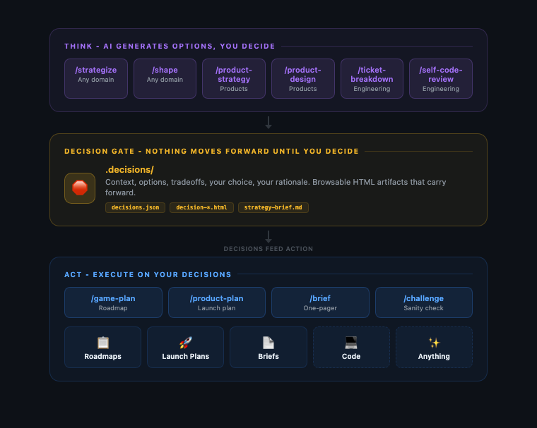
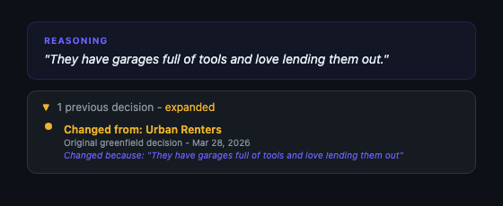

# Decision Kit

**AI does the busywork around your decisions. You make the calls.**

Decision Kit is the planning layer that runs before the building starts. Here's what that looks like.

```
/decide I wanna make a tool-sharing app for my neighborhood
```

You said one sentence. And then this shows up:

<p align="center"></p>

You didn't ask for this. You didn't design it. You didn't even know this was a decision you needed to make. The AI built this whole page out of nothing: the question, the four options, the visual previews, the tradeoffs, the comparison table, the recommendation. It read your one sentence, understood what you were actually trying to do, and surfaced the decision that makes or breaks the entire thing. "How do neighbors build trust?" Yeah. Obviously. How did you not think of that?

That keeps happening. Decision after decision, each one building on what you chose before. You came in with an idea and Decision Kit pulled out every decision hiding inside it, ordered them by what matters most, and walked you through each one with options you can actually see and compare. Not too many that you get decision fatigue, not too few that you're left wondering "wait, what are we actually building?"

You pick. It remembers. On to the next one. Go ahead, argue with the AI's recommendation. It's more fun that way.

---

## So what is it doing?

It reads your situation and finds the 5 to 7 decisions hiding inside it, ranked from most critical to least. For each one it does the work *around* the decision and then gets out of the way: gathers the research, builds four real options, renders visual previews, and lays the tradeoffs out side by side. Then it stops and waits for you. Every decision becomes an artifact you can open in a browser, compare, and still understand six months from now.

**This is the opposite of vibe coding.** Vibe coding is a blast: describe a thing, watch it get built, keep going. It works right up until you're hours deep in something nobody actually thought through, full of decisions that got made for you while you weren't looking. Decision Kit is the planning layer that goes first. It slows you down at the handful of moments where slow is worth it, then hands the build a real spec instead of a vibe.

Every skill is a folder of plain markdown, so this runs on whatever agentic coding tool you already use: Claude Code, Cursor, Codex, Copilot, Gemini CLI, your own. Nothing to install, no API key, no account.

Sibling project: [be-smarter](https://github.com/jnemargut/be-smarter). Decision Kit puts you in the loop. Be-smarter thinks that way even when you're not.

When you're done thinking, you can hand the whole stack of decisions to an AI coding tool and tell it to build. The decisions become the spec. Every choice you made, every reason you gave, every tradeoff you weighed... it's all there, structured, ready to inform the code. You're not starting from a blank prompt. You're starting from a decision record. Want to skip the build? Feel free. Decision Kit is happy being just a thinking tool. But if you want the thinking to turn into code, the path is right there.

---

## The same thing, for code

The example above is a product question. Here is the same thing when what you are
building is software, and the options are technical.

<p align="center"></p>

One sentence in (*"an app where my running club can log runs and see a leaderboard"*),
four decisions out. Architecture drawn as a stack diagram per option. The data model as
the actual tables, with real column names. Auth as the code each choice makes you write.

And then the part people do not expect:

<p align="center"></p>

You are not reading a description of four layouts. You are looking at four layouts,
built from the same data, with the tradeoffs spelled out (*"nine of twelve people are
literally below the fold"*). You pick the one you actually want before anyone writes
the component.

Four decisions later the folder is a spec. Hand it to Claude Code, Cursor, Codex, or
whatever you use, and the stack, the schema, the auth model, and the shape of the main
screen are already settled. The whole run is in
[examples/running-club-app](examples/running-club-app/).

---

## Contents

- [The same thing, for code](#the-same-thing-for-code)
- [The separation that matters](#the-separation-that-matters)
- [Start here in 2 minutes](#start-here-in-2-minutes)
- [How it works](#how-it-works)
- [The decision artifact](#the-decision-artifact)
- [Decisions compound](#decisions-compound)
- [Idea to code, at a glance](#idea-to-code-at-a-glance)
- [Greenfield and brownfield](#greenfield-and-brownfield)
- [What you can use this for](#what-you-can-use-this-for)
- [How this compares](#how-this-compares)
- [Skills](#skills)
- [Hooks](#hooks)
- [Build your own thinking skill](#build-your-own-thinking-skill)
- [Try it](#try-it-tell-us-what-happened)

---

## The separation that matters

**AI explores. You judge. Things get built.**

When the roles are explicit and the handoff is clean, decisions that used to take days take minutes. They also get better, because you can see them side by side, compare them, and go back to them months later without relying on anyone's memory.

This is Decision Driven Development. Software (and everything else) is built through decisions. Make those decisions structured, visual, and fast, and the building gets better. The output isn't slop because a human was in the loop at every point that mattered.

---

## Start here in 2 minutes

**1. Clone:**
```bash
git clone https://github.com/jnemargut/decision-kit.git
```

**2. Install the skills where your agent looks for them.**

Every skill is a folder with a `SKILL.md` inside, so this works with any agentic
coding tool that can load custom skills or commands.

<details open>
<summary><strong>Claude Code</strong></summary>

```bash
mkdir -p ~/.claude/skills
cp -r decision-kit/{thinking,action,configuration,orchestrator}/* ~/.claude/skills/
```
Use `.claude/skills/` inside a project instead if you only want them there.
</details>

<details>
<summary><strong>Any other agent (Cursor, Codex, Copilot, Gemini CLI, Aider, your own)</strong></summary>

Copy those same four folders into whatever directory your tool reads custom
skills, commands, or rules from:

```bash
cp -r decision-kit/{thinking,action,configuration,orchestrator}/* <your-tool's-skills-dir>/
```

No skills directory? Nothing is stopping you. Keep the repo somewhere handy and
point the agent at a skill directly:

```
Read decision-kit/orchestrator/decide/SKILL.md and follow it.
I want to make a tool-sharing app for my neighborhood.
```

The skills are plain markdown instructions. Anything that can read a file can run them.
</details>

**3. Run:**
```
/decide my friend and I are thinking about launching a food truck
```

Don't know which skill to use? That's the whole point of `/decide`. Say what's on your mind and it figures out the rest.

Or go direct if you already know what you need:
```
/strategize thinking about opening a coffee shop downtown
```

That also installs the **X tier**: `x-` prefixed versions of the core skills that think harder and use more of your usage budget. See the [skills reference](docs/skills.md#the-x-tier--xtra-thinking-xtra-usage).

A decision page pops open in your browser. Pick an option. Watch the next decision build on yours. Tell the AI its recommendation is wrong. Bring your own answer. Change your mind later. It's all part of the process.

---

## How it works

The system has two types of skills, and the boundary between them is everything.

<p align="center"></p>

**Thinking skills** do the thinking. They identify the decisions that matter for your situation, put them in order from most critical to least, and walk you through each one with visual options, comparisons, and a recommendation. Then they stop and wait for you to judge. They never execute anything. Their entire job is to surface the right decisions and make your judgment call as informed as possible.

**Action skills** execute on your judgment. They read what you decided and produce deliverables: roadmaps, launch plans, briefs, code. They never make judgment calls. They just do what you already decided.

**The decision** is the gate between thinking and doing. Nothing moves forward until a human has judged.

---

## The decision artifact

Every decision produces a real, tangible artifact you can open in a browser. Not notes buried in a doc. Not a Slack message someone will scroll past. A beautiful, structured page that lays out exactly what was considered and what was chosen.

<p align="center"></p>

Each page includes:

- **Context** - what's being decided and why it matters
- **Options** - 4 visual options with rendered previews (UI mockups, flow diagrams, persona cards, revenue models, whatever makes the difference visible)
- **Tradeoffs** - honest pros and cons for every option

<p align="center"></p>

- **Comparison** - side-by-side across the dimensions that matter

<p align="center"></p>

- **Your choice** - what you decided
- **Your reasoning** - why you chose it (captured when you volunteer it, never nagged out of you)

Open `.decisions/index.html` six months from now. See exactly what was decided, when, and why. New team member? Point them at the folder. Argument about why something was built a certain way? The answer is right there. Decisions stop being ephemeral things that happened in someone's head and start being artifacts that persist and compound.

---

## Decisions compound

Each skill reads the previous skill's decisions. No re-asking. No lost context. It just builds.

### Any domain: Strategize, Game Plan, Brief
```
/strategize we're launching a food truck        # think through the strategy
/game-plan                                    # generate the operational roadmap
/brief                                        # generate a shareable summary
```

### Product development: Strategy, Plan, Design
```
/product-strategy A tool-sharing app                 # figure out what and why
/product-plan                                        # generate the launch playbook
/product-design the v1 tool-sharing app we planned   # design decisions based on both
```

### Engineering: Strategy, Design, Ticket, Code
```
/product-strategy A tool-sharing app              # figure out what and why
/product-design the v1 app we planned             # design decisions
/ticket-breakdown Add OAuth2 login (PROJ-1234)    # implementation decisions for this ticket
# ... write the code using the implementation brief ...
```

Your strategy informs your design. Your design informs your engineering. Context builds instead of resetting, so you never start from zero.

---

## Idea to code, at a glance

It starts with one sentence about a thing you want to exist. By the time you're done, every meaningful decision has been made on purpose, and the build has something real to work from.

Here's what a full run looks like, end to end. Every step writes decisions. Every next step reads them. By the time you're building, the AI already knows everything you decided and why.

```
You:        /decide I want to build a daily briefing app for my calendar
Decision Kit:  [routes to /product-strategy, this sounds like a product idea]
            [asks the real questions: who is this for? what problem?
            why does it beat just opening Google Calendar?]
            [surfaces 5 strategic decisions you didn't know you had]
            [you pick, you judge, you argue with the recommendations]
            [writes .decisions/strategy-brief.md]

You:        /product-design the app we just planned
Decision Kit:  [reads the strategy brief, doesn't re-ask who it's for]
            [walks through framework, data model, auth, UX flows, component design]
            [you decide: server components, Postgres, OAuth, card-based UI]
            [writes the design decisions to .decisions/]

You:        /ticket-breakdown
Decision Kit:  [reads every prior decision, knows your stack]
            [breaks the work into tickets, surfaces the implementation
            decisions for each: scope, approach, testing, PR plan, risks]
            [writes implementation-plan.md, a mini-spec]

You:        "Now build it" (to any AI coding tool: Claude, Cursor, Codex)
AI:         [reads .decisions/, your full decision record]
            [builds against real decisions: who it's for, why it exists,
            how it should feel, what stack to use, how to test it]
```

One sentence in, working code out, and none of the thinking got skipped along the way. Every choice is in `.decisions/` with the reason attached, so a week from now you can open the folder and see exactly why the app is the way it is.

(Pairs well with Spec Kit and similar spec-driven tools - Decision Kit handles the thinking, they handle the building.)

---

## Greenfield and brownfield

Works whether you're dreaming something up or knee-deep in existing code.

### Greenfield (new ideas, exploration)

When you have an idea but no code yet, the danger isn't that you'll make bad decisions. It's that you'll skip them. You'll start building and assume you can figure it out as you go. Three weeks later you've made 40 decisions without realizing it, half of them contradict each other, and you can't remember why you chose any of them.

Greenfield mode is the antidote. You tell `/strategize`, `/shape`, `/product-strategy`, or `/product-design` what you're working on, and it surfaces the decisions you actually need to make before code gets in the way. Not every decision. The ones that matter. The ones that will haunt you if you skip them.

```
/strategize should we build a tool-sharing app for neighbors?
```

It identifies the decisions hiding in your idea. Who's this actually for? How do strangers learn to trust each other? What's the model that makes this not feel like an awkward favor? You see options for each one, you pick, you move on. Twenty minutes later you have a strategy brief that captures every choice and every reason. Now you can build, and every line of code traces back to a decision you made on purpose.

### Brownfield (existing code, no decisions recorded)

Every line of code is a decision someone made. The framework you chose. The way you handle errors. Whether sessions live in cookies or JWTs. The fact that signups need email verification but password resets don't. None of those are written down anywhere. They're not in the docs. They're not in the commit messages. They're encoded in the code itself, and the code is the only place they exist.

Your codebase is a graveyard of decisions nobody can see anymore.

`/excavate` reads your code and digs them out.

```
/excavate
```

<p align="center"></p>

It scans in layers: configs and dependencies first, then architecture, then patterns like error handling and state management, then higher-level signals like UX patterns and business model decisions. You confirm, review, or reject findings. Every confirmed finding becomes a recorded decision. The invisible becomes browsable.

From there, `/journal` evolves those decisions over time:

```
/journal our target user ended up being suburban homeowners, not urban renters
```

<p align="center"></p>

Decisions mature: early sketch (no reasoning) becomes firmed up (has reasoning) becomes evolved (has reasoning + history of changes). You can look at any decision and immediately know how mature it is.

> **Bonus for coders:** lost your context window? No problem. Your context is embedded in your decisions. Start a fresh session, point the AI at `.decisions/`, and it picks up exactly where you left off. The reasoning is right there in the JSON. The tradeoffs are in the HTML. The history is in the journal. You don't re-explain yourself, you just keep going.

---

## What you can use this for

These are just a handful of examples. Anywhere you need to make thoughtful decisions before committing to a direction, Decision Kit has a place. The pattern is always the same: you bring the situation, AI surfaces the decisions, you judge.

**In software:**

- **Prototype from scratch** - "I have an idea for an app" turns into a strategy brief, design decisions, and implementation plan before you write a line of code. Then you hand the decisions to an AI coding tool and what comes out actually makes sense.
- **Write a PRD** - Instead of staring at a blank doc, run `/product-strategy` and let it surface the decisions a good PRD needs to answer. Target user, positioning, business model, success metrics. Each one with options you can actually compare. The PRD writes itself from the decisions.
- **Think through a hard technical problem** - "Should we migrate to microservices or keep the monolith?" Stop debating in Slack. Run `/strategize` and get four well-framed options with real tradeoffs. Pick one. Move on.
- **Design a system architecture** - Run `/product-design` and walk through framework, database, auth, API design, state management. Each decision informs the next. You end up with an architecture that's deliberate, not accidental. And every choice is stored as a browsable artifact, basically ADRs that write themselves.
- **Break down a complex ticket** - Run `/ticket-breakdown` on a gnarly feature request. It reads your codebase, identifies the scope decisions, surfaces the testing strategy, and produces an implementation plan grounded in your actual code, not generic best practices.
- **Prepare for a design review** - Run `/strategize` on the problem space before you open Figma. Show up to the review with decisions already made about who it's for, what the constraints are, and why you went this direction.
- **Audit an inherited codebase** - Run `/excavate` on code you didn't write. It surfaces every decision the previous team made but never documented: why they chose JWT over sessions, why errors are handled that way, why the data model looks like that.

**Outside software:**

- **Launch a business** - Food truck, consulting practice, online store. Strategy first, then an operational game plan with concrete tasks and timelines.
- **Write a difficult email** - Run `/strategize` on "I need to push back on a client's timeline." It surfaces the decisions you need to make about framing, tone, what to include, what to leave out. The email you write afterward is deliberate, not reactive.
- **Plan an event** - Conference, workshop series, team offsite. Run `/shape` and walk through format, schedule, venue, content structure, guest experience. Each decision builds on the last.

The examples in this repo include [planning an app before building it](examples/running-club-app/), [Decision Kit redesigning its own design skills](examples/design-skills-upgrade/), a [neighborhood tool library](examples/community-app/), a [food truck launch](examples/food-truck/), and [wedding planning](examples/wedding-planning/).

---

## How this compares

| | Decision Kit | Vibe Coding | Prompt Libraries | Agent Frameworks | Traditional Planning |
|---|---|---|---|---|---|
| **Decisions are** | Structured artifacts | Made for you, invisibly | Ephemeral chat | Implicit in code | Docs nobody reads |
| **Human judgment** | Required at every gate | Skipped by design | Optional | Minimal | Upfront only |
| **Decisions compound** | Yes (each skill reads prior) | No | No | No | Manually |
| **Visual options** | Always | Never | Never | Never | Sometimes |
| **Execution** | After decisions, not before | Instead of decisions | Immediate | Immediate | Separate process |
| **Tracks changes** | History + reasoning | No | No | Git only | Version hell |

---

## Skills

You rarely need to pick one. `/decide` reads what you said and routes you.

```
/decide I wanna make a tool-sharing app for my neighborhood
```

| | |
|---|---|
| **Thinking skills** | Surface the decisions and wait for your judgment: `/strategize`, `/shape`, `/product-strategy`, `/product-design`, `/ticket-breakdown`, `/excavate`, `/journal`, `/core-principles`, `/red-team`, `/self-code-review`, `/design-system` |
| **Action skills** | Execute on what you decided: `/game-plan`, `/product-plan`, `/launch-playbook`, `/brief`, `/challenge`, `/visual-design` |
| **Configuration** | Teach it about you: `/whoiam`, `/research-sources` |
| **Routing** | `/decide`, plus `/autodecide`, `/overdecide`, `/underdecide` to change how many decisions you get |
| **The X tier** | `x-` versions that think harder and cost more usage: `/x-decide`, `/x-strategize`, `/x-shape`, `/x-product-strategy`, `/x-product-plan`, `/x-product-design`, `/x-game-plan`, `/x-visual-design`, `/x-challenge` |

**[Full skills reference](docs/skills.md)** for what each one does, when to use it, and what it produces.

---

## Hooks

> **Early-stage.** The hooks spec and `/hook-init` skill are designed but largely untested against live providers. The architecture is solid, the contracts are defined, and there are working examples, but no one has battle-tested this in production yet. Expect rough edges. Contributions welcome.

Decisions don't have to stay on your machine. Hooks let you sync decisions to external tools (issue trackers, chat platforms, dashboards, anything) with privacy controls and project bundling.

**What it enables:**
- **Sync** - decisions push to your provider automatically or on demand
- **Privacy** - all public, all private, or per-decision visibility (private by default)
- **Project bundling** - group decisions from multiple repos into one project on the provider
- **Auto-sync** - toggle real-time sync or accumulate locally and push when ready

**How it works:** Run `/hook-init` to connect a provider. The skill walks you through setup, installs hook scripts, and configures credentials. After that, your thinking skills sync decisions as you make them, or you say "push my decisions" when you're ready.

Cloud providers ship **hook packages**, just a manifest and a few shell scripts. No CLI to build, no installer to maintain. See [docs/building-a-provider.md](docs/building-a-provider.md) for the full guide with working examples.

For the full spec: [SPEC.md - Hooks](SPEC.md#hooks).

---

## Build your own thinking skill

The spec is open. If your skill does the thinking and waits for the human to judge, it's a thinking skill, and it composes with every other one.

1. Read [SPEC.md](SPEC.md) for the three rules
2. Read [docs/building-a-thinking-skill.md](docs/building-a-thinking-skill.md) for the step-by-step guide
3. Follow the pattern: do the thinking, show the options, wait for the judgment, remember the choice

---

## Try it. Tell us what happened.

Install a skill, run it on your next idea, and tell us what surprised you.

- Open an issue with your experience
- Share a screenshot of your favorite decision page
- Or build your own thinking skill and share it

The best part is finding out you had opinions you didn't know about until someone laid out the options.
